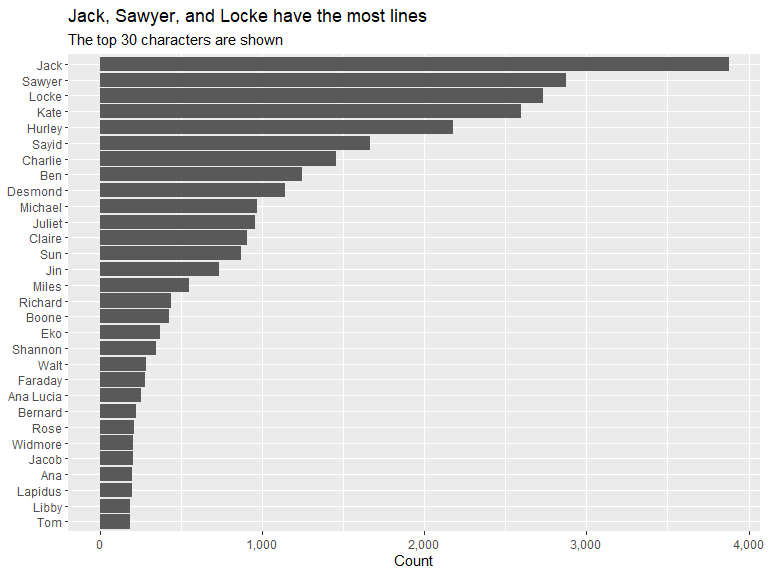
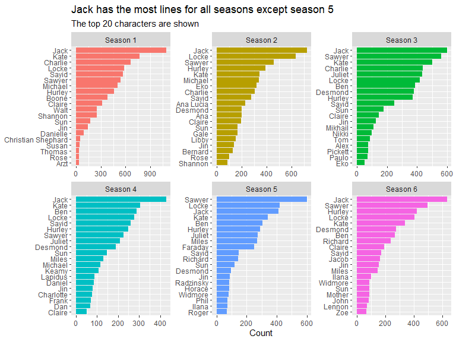
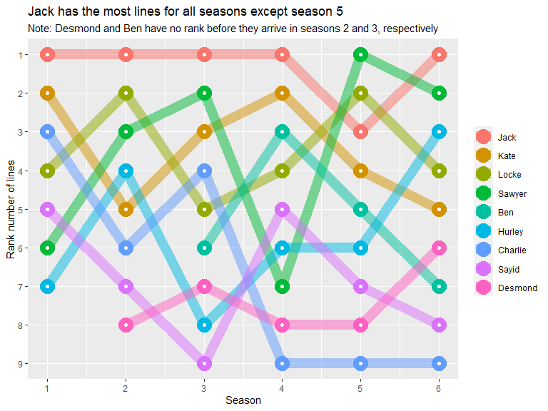
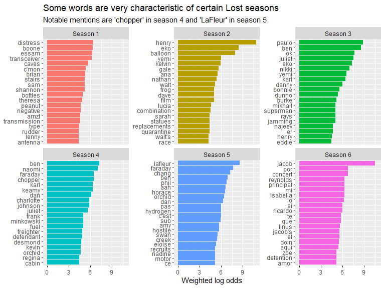
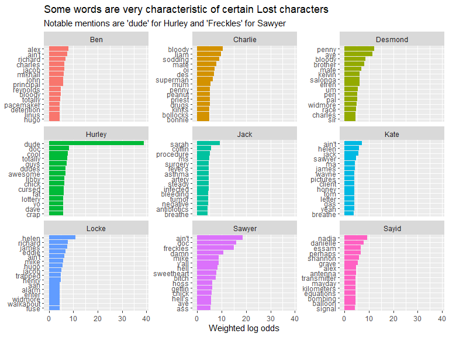
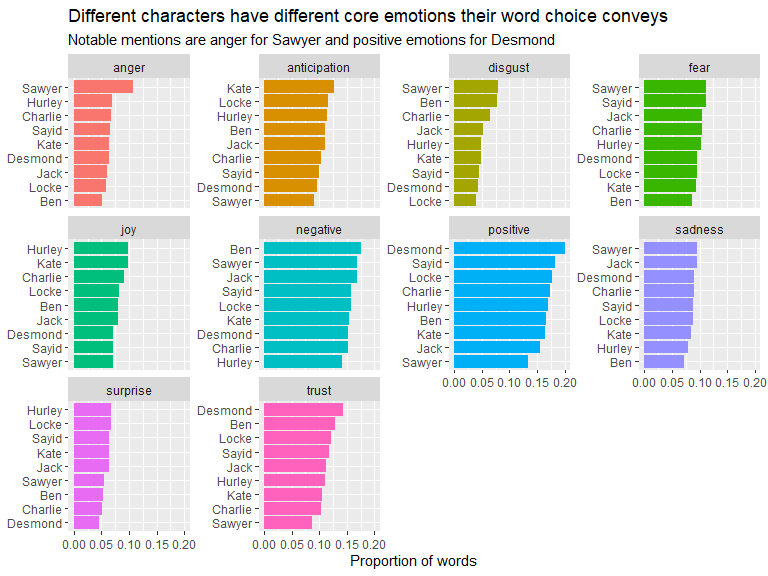
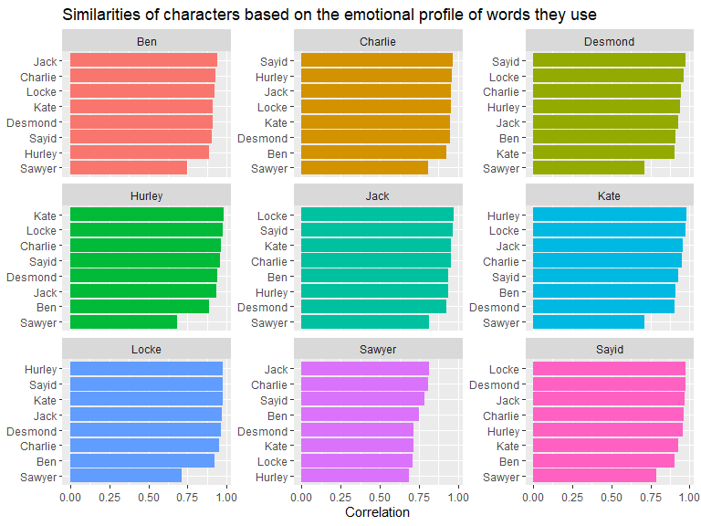

### Lost transcript analysis

    library(tidyverse)
    library(tidytext)
    library(scales)
    library(glue)

Below reads in the data I scraped from lostpedia.fandom.com. The
Rmarkdown to scrape episode transcripts can be found in the
scrape\_episode\_transcripts.Rmd file.

    lost <- read_csv("data/lost_transcripts.csv")

    #remove season 0 (Lost: Missing Pieces)
    lost <- lost %>%
        filter(season != 0)

 

### Which Lost characters have the most lines?

    lost %>%
        mutate(character = fct_lump(character, 30)) %>%
        filter(character != "Other") %>%
        count(character) %>%
        mutate(character = fct_reorder(character, n)) %>%
        ggplot(aes(n, character)) +
        geom_col() +
        labs(x = "Count",
             y = NULL,
             title = "Jack, Sawyer, and Locke have the most lines",
             subtitle = "The top 30 characters are shown") +
        scale_x_continuous(labels = comma_format())

 

### Which characters have the most lines per season?

    lost %>%
        count(season, character) %>%
        group_by(season) %>%
        slice_max(n, n = 20) %>% 
        ungroup() %>%
        mutate(character = reorder_within(character, n, season)) %>%
        mutate(season = glue("Season {season}")) %>%
        ggplot(aes(n, character, fill = season)) +
        geom_col() +
        facet_wrap(~season, scales = "free") +
        labs(x = "Count",
             y = NULL,
             title = "Jack has the most lines for all seasons except season 5",
             subtitle = "The top 20 characters are shown") +
        scale_y_reordered() +
        theme(legend.position = "none")

 

### How has the characters with the most lines changed over six seasons?

    character_counts <- lost %>%
        count(character, sort = TRUE)

    top_n_characters <- 9

    lost %>%
        semi_join(character_counts %>% head(top_n_characters)) %>%
        count(season, character) %>%
        group_by(season) %>%
        mutate(rank = rank(-n)) %>%
        ungroup() %>%
        mutate(character = fct_reorder(character, rank, .fun = mean)) %>%
        ggplot(aes(season, rank, group = character)) +
        geom_line(aes(color = character), size = 5, alpha = 0.5) +
        geom_point(aes(color = character), size = 7) +
        geom_point(size = 1.5, color = "white") +
        scale_y_reverse(breaks = 1:top_n_characters, minor_breaks = 1) +
        scale_x_continuous(breaks = 1:6) +
        labs(x = "Season",
             y = "Rank number of lines",
             color = NULL,
             title = "Jack has the most lines for all seasons except season 5",
             subtitle = "Note: Desmond and Ben have no rank before they arrive in seasons 2 and 3, respectively")

 

### Which words are most characteristic of each Lost season?

    library(tidylo)

    lost %>%
        unnest_tokens(word, line) %>%
        count(season, word, sort = TRUE) %>%
        bind_log_odds(season, word, n) %>%
        group_by(season) %>%
        slice_max(log_odds_weighted, n = 20) %>%
        ungroup() %>%
        mutate(word = reorder_within(word, log_odds_weighted, season)) %>%
        mutate(season = glue("Season {season}")) %>%
        ggplot(aes(log_odds_weighted, word, fill = factor(season))) +
        geom_col() +
        facet_wrap(~season, scales = "free_y") +
        scale_y_reordered() +
        theme(legend.position = "none") +
        labs(x = "Weighted log odds",
             y = NULL,
             title = "Some words are very characteristic of certain Lost seasons",
             subtitle = "Notable mentions are 'chopper' in season 4 and 'LaFleur' in season 5")

 

### Which words are most characteristic of each Lost character?

    lost %>%
        semi_join(character_counts %>% head(top_n_characters)) %>%
        unnest_tokens(word, line) %>%
        count(character, word, sort = TRUE) %>%
        bind_log_odds(character, word, n) %>%
        group_by(character) %>%
        slice_max(log_odds_weighted, n = 15) %>%
        ungroup() %>%
        mutate(word = reorder_within(word, log_odds_weighted, character)) %>%
        ggplot(aes(log_odds_weighted, word, fill = character)) +
        geom_col() +
        facet_wrap(~character, scales = "free_y") +
        scale_y_reordered() +
        theme(legend.position = "none") +
        labs(x = "Weighted log odds",
             y = NULL,
             title = "Some words are very characteristic of certain Lost characters",
             subtitle = "Notable mentions are 'dude' for Hurley and 'Freckles' for Sawyer")

 

### Which emotions are most related to which Lost characters?

    library(textdata)

    lost %>%   
        semi_join(character_counts %>% head(9)) %>%
        unnest_tokens(word, line) %>%
        inner_join(lexicon_nrc()) %>%
        add_count(character) %>%
        count(character, sentiment, n, name = "sentiment_n") %>%
        mutate(prop = sentiment_n / n) %>%
        mutate(character = reorder_within(character, prop, sentiment)) %>%
        ggplot(aes(prop, character, fill = sentiment)) +
        geom_col() +
        facet_wrap(~sentiment, scales = "free_y") +
        scale_y_reordered() +
        theme(legend.position = "none") +
        labs(x = "Proportion of words",
             y = NULL,
             title = "Different characters have different core emotions their word choice conveys",
             subtitle = "Notable mentions are anger for Sawyer and positive emotions for Desmond")

 

### Which Lost characters are most similar in the emotionality of their words?

This analysis compares the emotional profile for each of the top {r
top\_n\_characters} characters to determine which characters are most
similar based on their use of language.

    library(widyr)
        
    lost %>%   
        semi_join(character_counts %>% head(top_n_characters)) %>%
        unnest_tokens(word, line) %>%
        inner_join(lexicon_nrc()) %>%
        add_count(character) %>%
        count(character, sentiment, n, name = "sentiment_n") %>%
        mutate(prop = sentiment_n / n) %>%
        pairwise_cor(character, sentiment, prop) %>% 
        mutate(item1 = reorder_within(item1, correlation, item2)) %>%
        ggplot(aes(correlation, item1, fill = item2)) +
        geom_col() +
        facet_wrap(~item2, scales = "free_y") +
        scale_y_reordered() +
        theme(legend.position = "none") +
        labs(x = "Correlation",
             y = NULL,
             title = "Similarities of characters based on the emotional profile of words they use")

         
