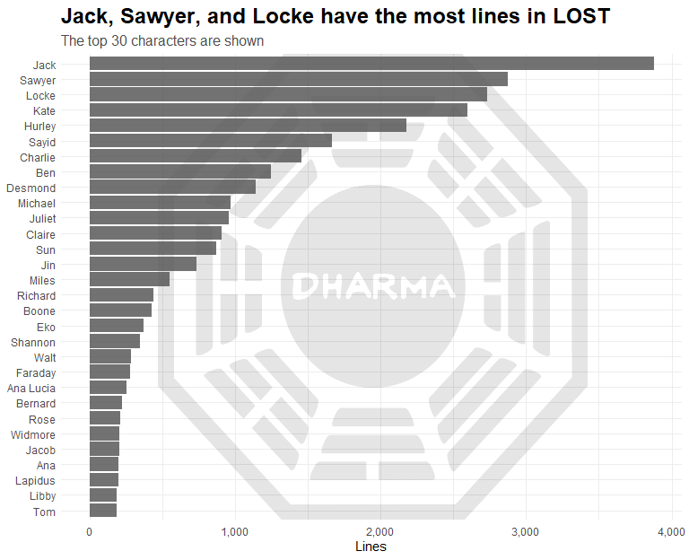
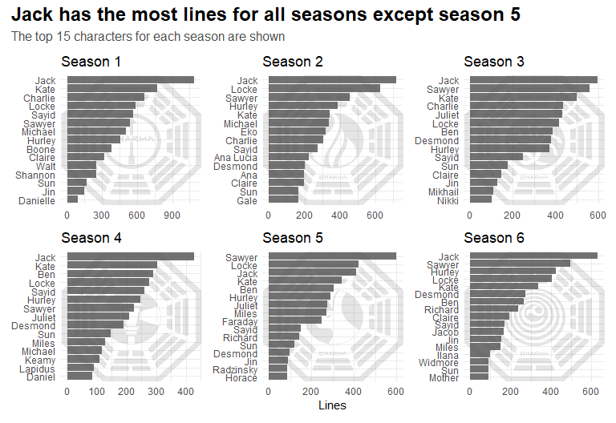
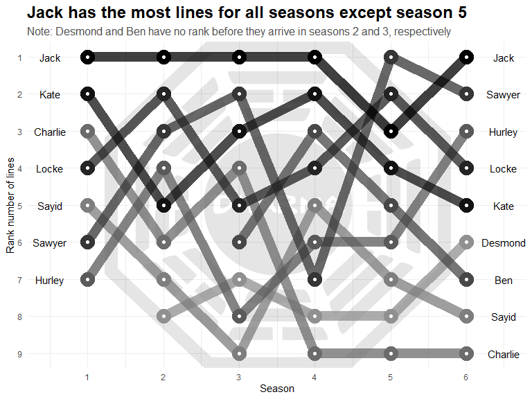
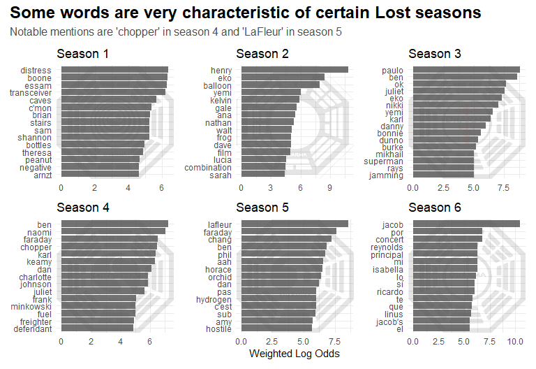
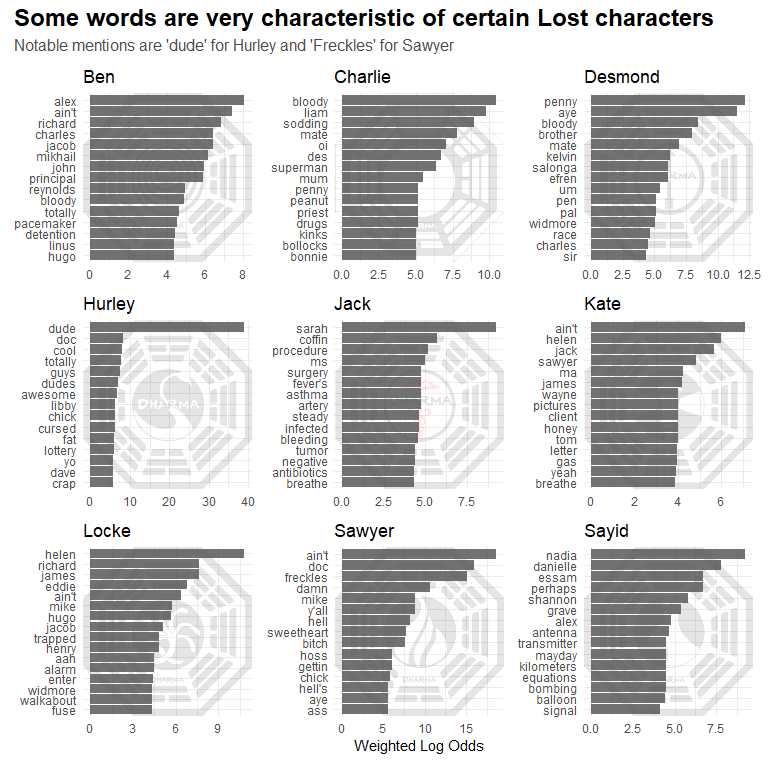
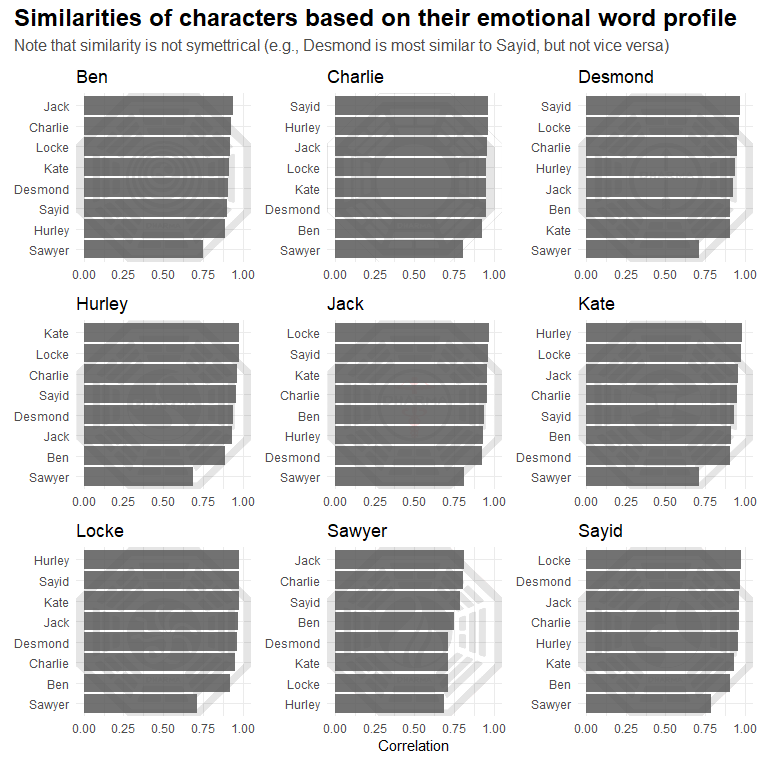

### Lost transcript analysis

``` r
library(tidyverse)
library(tidytext)
library(scales)
library(glue)
library(ggimage)
library(jpeg)
library(grid)
library(patchwork)
library(tidylo)
```

``` r
theme_update(plot.title = element_text(size = 18, face = "bold"),
          plot.subtitle = element_text(size = 12, color = "grey30"))
```

Below reads in the data I scraped from lostpedia.fandom.com. The
Rmarkdown to scrape episode transcripts can be found in the
scrape_episode_transcripts.Rmd file.

``` r
lost <- read_csv("data/lost_transcripts.csv")

#remove season 0 (Lost: Missing Pieces)
lost <- lost %>%
    filter(season != 0)
```

<br />

### Which Lost characters have the most lines?

``` r
bg_img <- readPNG("images/dharma_logo_alpha_10.png")

top_n  <- 30

lost %>%
    mutate(character = fct_lump(character, top_n)) %>%
    filter(character != "Other") %>%
    count(character) %>%
    mutate(character = fct_reorder(character, n)) %>%
    ggplot(aes(n, character)) +
    annotation_custom(rasterGrob(bg_img, width = unit(1, "npc"), height = unit(1, "npc")), 
                  -Inf, Inf, -Inf, Inf) +
    geom_col(alpha = 0.85) +
    labs(x = "Lines",
         y = NULL,
         title = "Jack, Sawyer, and Locke have the most lines in LOST",
         subtitle = glue("The top {top_n} characters are shown")) +
    scale_x_continuous(labels = comma_format()) +
    theme_minimal() +
    theme(plot.title = element_text(size = 18, face = "bold"),
          plot.subtitle = element_text(size = 12, color = "grey30"))
```



<br />

### Which characters have the most lines per season?

``` r
plot_top_lines <- function(tbl, x, y, facet_var, facet, bg_img, x_label = NULL, color = "grey35"){
    tbl %>%
        filter({{facet_var}} == facet) %>%
        mutate({{y}} := fct_reorder({{y}}, {{x}})) %>%
        ggplot(aes({{x}}, {{y}})) +
        annotation_custom(rasterGrob(readPNG(bg_img),
                                     width = unit(1, "npc"),
                                     height = unit(1, "npc")),
                          -Inf, Inf, -Inf, Inf) +
        geom_col(fill = color, alpha = 0.85) +
        labs(x = x_label,
             y = NULL,
             title = facet) +
        theme_minimal()
}

plot_2_data <- lost %>%
    count(season, character) %>%
    group_by(season) %>%
    slice_max(n, n = 15) %>% 
    ungroup() %>%
    mutate(character = if_else(character == "Christian Shephard", "Christian", character)) %>%
    mutate(season = glue("Season {season}"))

plot_top_lines(plot_2_data, n, character, season, "Season 1", "images/the_arrow_alpha_10.png") + 
    plot_top_lines(plot_2_data, n, character, season, "Season 2", "images/the_flame_alpha_10.png") +
    plot_top_lines(plot_2_data, n, character, season, "Season 3", "images/the_hydra_alpha_10.png") +
    plot_top_lines(plot_2_data, n, character, season, "Season 4", "images/the_lamp_post_alpha_10.png") +
    plot_top_lines(plot_2_data, n, character, season, "Season 5", "images/the_looking_glass_alpha_10.png", "Lines") +
    plot_top_lines(plot_2_data, n, character, season, "Season 6", "images/the_orchid_alpha_10.png") +
    plot_annotation(title = "Jack has the most lines for all seasons except season 5",
                    subtitle = "The top 15 characters for each season are shown")
```



<br />

### How has the characters with the most lines changed over six seasons?

``` r
character_counts <- lost %>%
    count(character, sort = TRUE)

top_n_characters <- 9

lost %>%
    semi_join(character_counts %>% head(top_n_characters)) %>%
    count(season, character) %>%
    group_by(season) %>%
    mutate(rank = rank(-n)) %>%
    ungroup() %>%
    mutate(label_s1 = ifelse(season == 1, character, "")) %>%
    mutate(label_s6 = ifelse(season == 6, character, "")) %>%
    mutate(character = fct_reorder(character, rank, .fun = mean)) %>%
    mutate(character = fct_rev(character)) %>% 
    ggplot(aes(season, rank, group = character)) +
    annotation_custom(rasterGrob(bg_img, width = unit(1, "npc"), height = unit(1, "npc")), 
              -Inf, Inf, -Inf, Inf) +
    geom_line(aes(color = character), size = 5, alpha = 0.75) +
    geom_point(aes(color = character), size = 7) +
    geom_point(size = 1.5, color = "white") +
    geom_text(aes(label = label_s1), nudge_x = -0.5) +
    geom_text(aes(label = label_s6), nudge_x = 0.5) +
    scale_y_reverse(breaks = 1:top_n_characters, minor_breaks = 1) +
    scale_x_continuous(breaks = 1:6) +
    labs(x = "Season",
         y = "Rank number of lines",
         color = NULL,
         title = "Jack has the most lines for all seasons except season 5",
         subtitle = "Note: Desmond and Ben have no rank before they arrive in seasons 2 and 3, respectively") +
    scale_color_manual(values = c("#909090", "#7e7e7e", "#6c6c6c", "#5a5a5a", 
                                  "#484848", "#363636", "#242424", "#121212", "#000000")) +
    theme_minimal() +
    theme(legend.position = "none",
          plot.title = element_text(size = 18, face = "bold"),
          plot.subtitle = element_text(size = 12, color = "grey30"))
```



<br />

### Which words are most characteristic of each Lost season?

``` r
plot_4_data <- lost %>%
    unnest_tokens(word, line) %>%
    count(season, word, sort = TRUE) %>%
    bind_log_odds(season, word, n) %>%
    group_by(season) %>%
    slice_max(log_odds_weighted, n = 20) %>%
    ungroup() %>%
    mutate(season = glue("Season {season}"))

plot_top_lines(plot_4_data, log_odds_weighted, word, season, "Season 1", "images/the_orchid_alpha_10.png") + 
    plot_top_lines(plot_4_data, log_odds_weighted, word, season, "Season 2", "images/the_pearl_alpha_10.png") +
    plot_top_lines(plot_4_data, log_odds_weighted, word, season, "Season 3", "images/the_staff_alpha_10.png") +
    plot_top_lines(plot_4_data, log_odds_weighted, word, season, "Season 4", "images/the_swan_alpha_10.png") +
    plot_top_lines(plot_4_data, log_odds_weighted, word, season, "Season 5", "images/the_tempest_alpha_10.png", "Weighted Log Odds") +
    plot_top_lines(plot_4_data, log_odds_weighted, word, season, "Season 6", "images/the_arrow_alpha_10.png") +
    plot_annotation(title = "Some words are very characteristic of certain Lost seasons",
                    subtitle = "Notable mentions are 'chopper' in season 4 and 'LaFleur' in season 5")
```



<br />

### Which words are most characteristic of each Lost character?

``` r
plot_5_data <- lost %>%
    semi_join(character_counts %>% head(top_n_characters)) %>%
    unnest_tokens(word, line) %>%
    count(character, word, sort = TRUE) %>%
    bind_log_odds(character, word, n) %>%
    group_by(character) %>%
    slice_max(log_odds_weighted, n = 15) %>%
    ungroup()

plot_top_lines(plot_5_data, log_odds_weighted, word, character, "Ben", "images/the_orchid_alpha_10.png") + 
    plot_top_lines(plot_5_data, log_odds_weighted, word, character, "Charlie", "images/the_pearl_alpha_10.png") +
    plot_top_lines(plot_5_data, log_odds_weighted, word, character, "Desmond", "images/the_arrow_alpha_10.png") +
    plot_top_lines(plot_5_data, log_odds_weighted, word, character, "Hurley", "images/the_swan_alpha_10.png") +
    plot_top_lines(plot_5_data, log_odds_weighted, word, character, "Jack", "images/the_staff_alpha_10.png") +
    plot_top_lines(plot_5_data, log_odds_weighted, word, character, "Kate", "images/the_lamp_post_alpha_10.png") +
    plot_top_lines(plot_5_data, log_odds_weighted, word, character, "Locke", "images/the_hydra_alpha_10.png") +
    plot_top_lines(plot_5_data, log_odds_weighted, word, character, "Sawyer", "images/the_flame_alpha_10.png", "Weighted Log Odds") +
    plot_top_lines(plot_5_data, log_odds_weighted, word, character, "Sayid", "images/the_looking_glass_alpha_10.png") +
    plot_annotation(title = "Some words are very characteristic of certain Lost characters",
                    subtitle = "Notable mentions are 'dude' for Hurley and 'Freckles' for Sawyer")
```



<br />

### Which emotions are most related to which Lost characters?

``` r
library(textdata)

plot_6_data <- lost %>%   
    semi_join(character_counts %>% head(9)) %>%
    unnest_tokens(word, line) %>%
    inner_join(lexicon_nrc()) %>%
    add_count(character) %>%
    count(character, sentiment, n, name = "sentiment_n") %>%
    mutate(prop = sentiment_n / n)

layout <- "
AABC
AADE
FFGH
FFIJ
"

pos_color_main <- "#5b664e"
pos_color <- "#959e8b"
neg_color_main <- "#5c5050"
neg_color <- "#a89b9b"

plot_top_lines(plot_6_data, prop, character, sentiment, "positive", "images/the_arrow_alpha_10.png", color = pos_color_main) + 
    plot_top_lines(plot_6_data, prop, character, sentiment, "joy", "images/the_flame_alpha_10.png", color = pos_color) +
    plot_top_lines(plot_6_data, prop, character, sentiment, "anticipation", "images/the_hydra_alpha_10.png", color = pos_color) +
    plot_top_lines(plot_6_data, prop, character, sentiment, "surprise", "images/the_lamp_post_alpha_10.png", color = pos_color) +
    plot_top_lines(plot_6_data, prop, character, sentiment, "trust", "images/the_looking_glass_alpha_10.png", color = pos_color) +
    plot_top_lines(plot_6_data, prop, character, sentiment, "negative", "images/the_orchid_alpha_10.png", "Proportion of Words", color = neg_color_main) +
    plot_top_lines(plot_6_data, prop, character, sentiment, "fear", "images/the_pearl_alpha_10.png", color = neg_color) +
    plot_top_lines(plot_6_data, prop, character, sentiment, "sadness", "images/the_staff_alpha_10.png", color = neg_color) +
    plot_top_lines(plot_6_data, prop, character, sentiment, "disgust", "images/the_swan_alpha_10.png", "Proportion of Words", color = neg_color) +
        plot_top_lines(plot_6_data, prop, character, sentiment, "anger", "images/the_tempest_alpha_10.png", "Proportion of Words", color = neg_color) +
    plot_annotation(title = "Different characters have different core emotions",
                    subtitle = "Notable mentions are anger for Sawyer and positive emotions for Desmond") +
    plot_layout(design = layout)
```


<br />

### Which Lost characters are most similar in the emotionality of their words?

This analysis compares the emotional profile for each of the top {r
top_n\_characters} characters to determine which characters are most
similar based on their use of language.

``` r
library(widyr)
    
plot_7_data <- lost %>%   
    semi_join(character_counts %>% head(top_n_characters)) %>%
    unnest_tokens(word, line) %>%
    inner_join(lexicon_nrc()) %>%
    add_count(character) %>%
    count(character, sentiment, n, name = "sentiment_n") %>%
    mutate(prop = sentiment_n / n) %>%
    pairwise_cor(character, sentiment, prop)

plot_top_lines(plot_7_data, correlation, item1, item2, "Ben", "images/the_orchid_alpha_10.png") + 
    plot_top_lines(plot_7_data, correlation, item1, item2, "Charlie", "images/the_pearl_alpha_10.png") +
    plot_top_lines(plot_7_data, correlation, item1, item2, "Desmond", "images/the_arrow_alpha_10.png") +
    plot_top_lines(plot_7_data, correlation, item1, item2, "Hurley", "images/the_swan_alpha_10.png") +
    plot_top_lines(plot_7_data, correlation, item1, item2, "Jack", "images/the_staff_alpha_10.png") +
    plot_top_lines(plot_7_data, correlation, item1, item2, "Kate", "images/the_lamp_post_alpha_10.png") +
    plot_top_lines(plot_7_data, correlation, item1, item2, "Locke", "images/the_hydra_alpha_10.png") +
    plot_top_lines(plot_7_data, correlation, item1, item2, "Sawyer", "images/the_flame_alpha_10.png", "Correlation") +
    plot_top_lines(plot_7_data, correlation, item1, item2, "Sayid", "images/the_looking_glass_alpha_10.png") +
    plot_annotation(title = "Similarities of characters based on their emotional word profile",
                    subtitle = "Note that similarity is not symettrical (e.g., Desmond is most similar to Sayid, but Sayid is not most similar to Desmond)")
```



<br /> <br /> <br /> <br /> <br /> <br />
